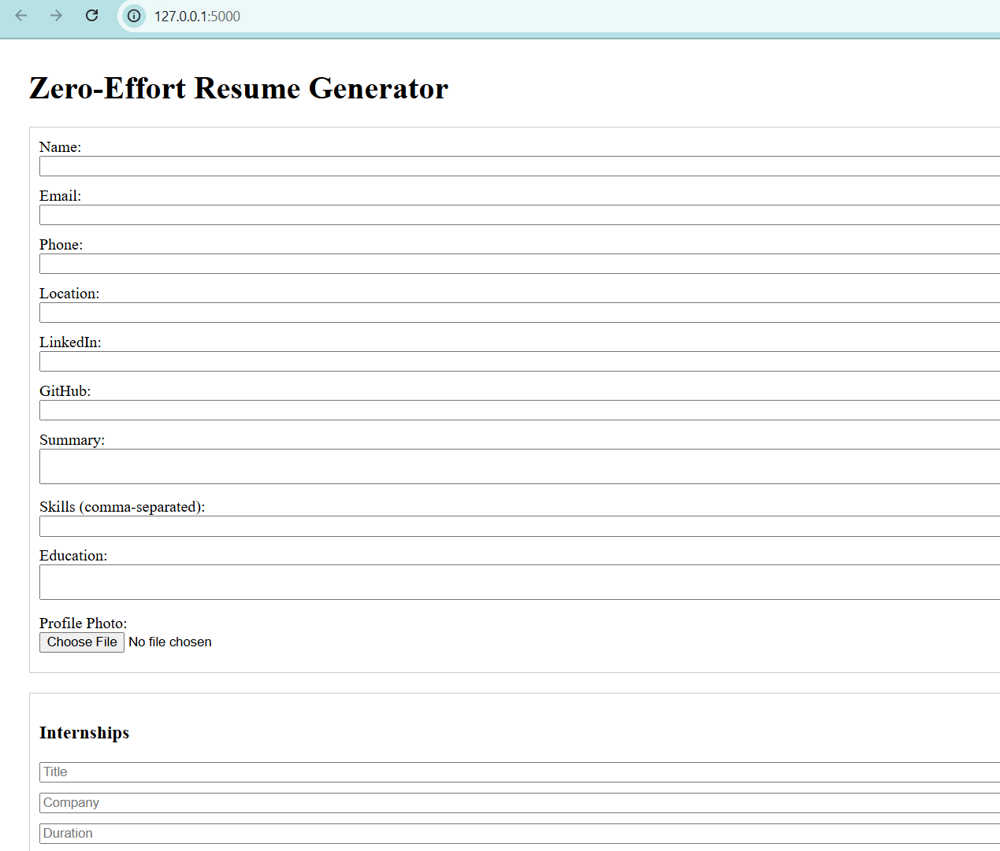
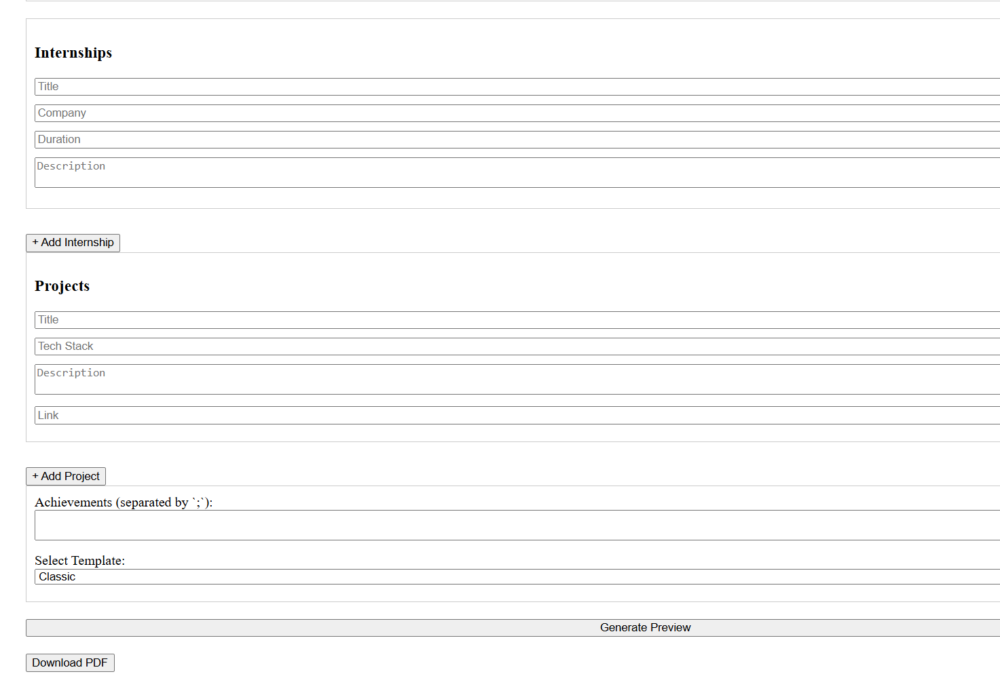
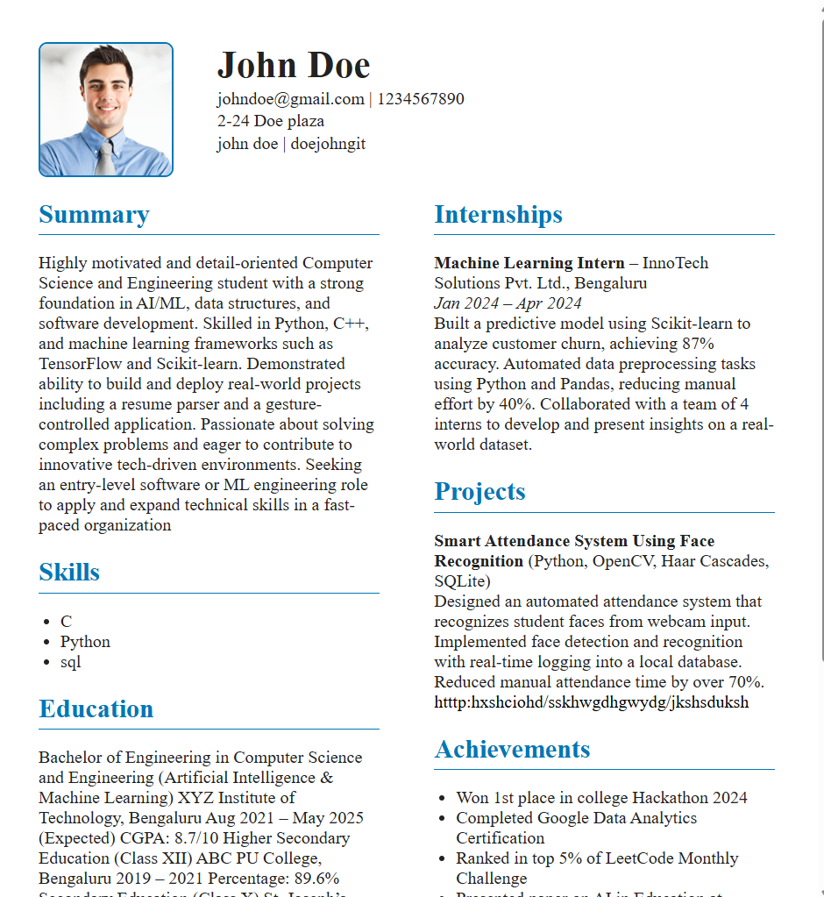
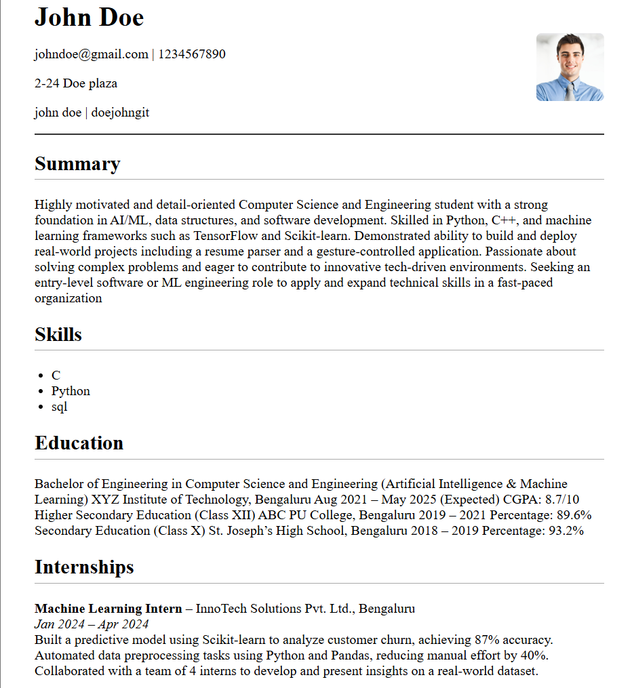

# Zero-Effort Resume Generator

A simple Flask-based web app that lets you create professional resumes with zero effort. Supports multiple templates, profile photo upload, and instant PDF download using WeasyPrint.

## 💡 Features

- Dynamic resume form (name, summary, skills, projects, internships)
- Upload profile photo
- Choose between Classic, Modern, and Minimal templates
- Real-time preview
- One-click PDF download (WeasyPrint powered)

## 🚀 Run Locally

1. Clone the repository:

```bash
git clone https://github.com/pranam-sap/zero-effort.git
cd zero-effort
```

2. Install dependencies:

```bash
pip install -r requirements.txt
```

3. Run the Flask server:

```bash
python app.py
```

4. Open your browser and go to:

```
http://localhost:5000
```

## 📁 Folder Structure

```
zero-effort/
├── app.py
├── form.html
├── templates/
│   ├── template1.html
│   ├── template2.html
│   └── template3.html
├── static/
│   └── uploads/     ← where profile photos are stored
├── requirements.txt
└── README.md
```

## 📦 Dependencies

- Flask
- WeasyPrint
- Werkzeug

You can generate the full environment using `pip freeze > requirements.txt`

## 🛠 Built With

- Python & Flask
- HTML / CSS (Times New Roman based)
- WeasyPrint for PDF generation

---

## 📸 Screenshots

### 🖥️ Web App Interface
| Form Page | Resume Preview |
|-----------|----------------|
|  |  |

### 📝 Templates in PDF

**Classic Template**


**Modern Template**


**Minimal Template**



## 🔒 License

[MIT](https://choosealicense.com/licenses/mit/)
